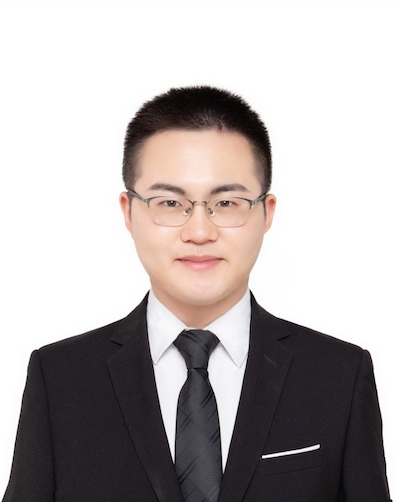

## Biography

|                       |          |
| ----------------------| -------- |
|  | Ph.D. student at Institute of Information Engineering, Chinese Academy of Sciences, studying computer science, focusing on machine learning for natural language.     As a young researcher, your interest and kind citation (star) will definitely mean a lot for me and my collaborators. |

## Education

|                                              |          |
| -------------------------------------------- | -------- |
|                     | **Sep. 2017 - Jul. 2022 (Expected)**   Institute of Information Engineering, Chinese Academy of Sciences, *Beijing, China*   **Ph.D. in Computer Science** |
|  | **Jan. 2017 - Jul. 2017**   STIC/OSM Laboratory, ENSTA Bretagne, *Brest, France*   **Study Abroad Funded by CSC** |
|                        | **Jul. 2014 - Jul. 2017**   Computer and Communication Engineering College, China University of Petroleum (East China), *Qingdao, China*   **B.S. in Computer Science and Technology** |
|                        | **Sep. 2012 - Jul. 2014**   School of Geosciences, China University of Petroleum (East China), *Qingdao, China*   **B.S. in Surveying Engineering** |

## Publications

- Zheng Fang, Yanan Cao, Tai Li, **Ruipeng Jia**, Fang Fang, Yanmin Shang and Yuhai Lu.
  **TEBNER: Domain Specific Named Entity Recognition with Type Expanded Boundary-aware Network**.
  The 2021 Conference on Empirical Methods in Natural Language Processing (**EMNLP'2021**, Main Conference).
  *Punta Cana, Dominican Republic*. November, 2021.

- **Ruipeng Jia**, Yanan Cao, Fang Fang, Yuchen Zhou, Zheng Fang, Yanbing Liu and Shi Wang.
  **Deep Differential Amplifier for Extractive Summarization**.
  The 59th Annual Meeting of the Association for Computational Linguistics (**ACL'2021**, Main Conference).
  Page 366-376.
  *Bangkok, Thailand*. August, 2021.

- Hengzhu Tang, Yanan Cao, Zhenyu Zhang, **Ruipeng Jia**, Fang Fang, and Shi Wang.
  **Multi-Granularity Heterogeneous Graph for Document-Level Relation Extraction**.
  2021 IEEE International Conference on Acoustics, Speech and Signal Processing (**ICASSP'2021**).
  *Toronto, Canada*. June, 2021.

- **Ruipeng Jia**, Yanan Cao, Haichao Shi, Fang Fang, Pengfei Yin, and Shi Wang.
  **Flexible Non-Autoregressive Extractive Summarization with Threshold: How to Extract a Non-Fixed Number of Summary Sentences**.
  The Thirty-Fifth AAAI Conference on Artificial Intelligence (**AAAI'2021**).
  Page 13134-13142.
  *Vancouver, Canada*. February, 2021.

- **Ruipeng Jia**, Yanan Cao, Hengzhu Tang, Fang Fang, Cong Cao and Shi Wang.
  **Neural Extractive Summarization with Hierarchical Attentive Heterogeneous Graph Network**.
  The 2020 Conference on Empirical Methods in Natural Language Processing (**EMNLP'2020**, Main Conference).
  Page 3622–3631.
  *Barcelona, Spain*. November, 2020.

- **Ruipeng Jia**, Yanan Cao, Haichao Shi, Fang Fang, Yanbing Liu and Jianlong Tan.
  **DistilSum: Distilling the Knowledge for Extractive Summarization**.
  29th ACM International Conference on Information and Knowledge Management (**CIKM'2020**).
  Page 2069–2072.
  *Galway, Ireland*. October, 2020.

- **Ruipeng Jia**, Yanan Cao, Fang Fang, Jinpeng Li, Yanbing Liu and Pengfei Yin.
  **Enhancing Pre-trained Language Representation for Multi-Task Learning of Scientific Summarization**.
  The 2020 International Joint Conference on Neural Networks (**IJCNN'2020**).
  Page 1-8.
  *Glasgow, UK*. July, 2020.

- Jinpeng Li, Chuang Zhang, Xiaojun Chen, Yanan Cao and **Ruipeng Jia**.
  **Improving Abstractive Summarization with Modeling Iterative Representation**.
  The 2020 International Joint Conference on Neural Networks (**IJCNN'2020**).
  *Glasgow, UK*. July, 2020.

- **Ruipeng Jia**, Yanan Cao, Fang Fang, Jinpeng Li, Yanbing Liu and Pengfei Yin.
  **Enhancing Textual Representation for Abstractive Summarization: Leveraging Masked Decoder**.
  The 2020 International Joint Conference on Neural Networks (**IJCNN'2020**).
  Page 1-8.
  *Glasgow, UK*. July, 2020.

- Hao Xu, Yanan Cao, **Ruipeng Jia**, Yanbing Liu and Jianlong Tan.
  **Sequence Generative Adversarial Network for Long Text Summarization**.
  IEEE 30th International Conference on Tools with Artificial Intelligence (**ICTAI'2018**).
  *Volos, Greece*. November, 2018.

## Working Experience

|                                              |          |
| -------------------------------------------- | -------- |
|  | **Mar. 2021 - Now**   Research Intern in the Natural Language Computing at Microsoft Research   *Beijing, China* |
|  | **Mar. 2018 - Jun. 2018**   Research Intern in the Data Science Lab at JD.com   *Beijing, China* |
