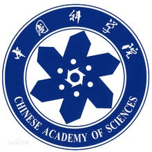
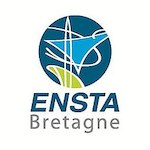
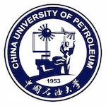

## Biography
PhD student at Institute of Information Engineering, Chinese Academy of Sciences, studying computer science, focusing on machine learning for natural language.

As a young researcher, your interest and kind citation (star) will definitely mean a lot for me and my collaborators.

## Education

|                                              |          |
| -------------------------------------------- | -------- |
|                     | **Sep. 2017 - Jul. 2022 (Expected)**   Institute of Information Engineering, Chinese Academy of Sciences   *Beijing, China*     **Ph.D. in Computer Science** |
|  | **Jan. 2017 - Jul. 2017**   STIC/OSM Laboratory, ENSTA Bretagne   *Brest, France*     **Study Abroad Funded by CSC** |
|                        | **Jul. 2014 - Jul. 2017**   Computer and Communication Engineering College, China University of Petroleum (East China)   *Qingdao, China*     **B.S. in Computer Science and Technology** |
|                        | **Sep. 2012 - Jul. 2014**   School of Geosciences, China University of Petroleum (East China)   *Qingdao, China*     **B.S. in Surveying Engineering** |

## Publications

- **Ruipeng Jia**, Yanan Cao, Haichao Shi, Fang Fang, Pengfei Yin, and Shi Wang.
  **Flexible Non-Autoregressive Extractive Summarization with Threshold: How to Extract a Non-Fixed Number of Summary Sentences**.
  The Thirty-Fifth AAAI Conference on Artificial Intelligence(**AAAI'2021**).
  Vancouver, Canada. February, 2021.

- **Ruipeng Jia**, Yanan Cao, Hengzhu Tang, Fang Fang, Cong Cao and Shi Wang.
  **Neural Extractive Summarization with Hierarchical Attentive Heterogeneous Graph Network**.
  The 2020 Conference on Empirical Methods in Natural Language Processing(**EMNLP'2020**).
  Barcelona, Spain. November, 2020.

- **Ruipeng Jia**, Yanan Cao, Haichao Shi, Fang Fang, Yanbing Liu and Jianlong Tan.
  **DistilSum: Distilling the Knowledge for Extractive Summarization**.
  29th ACM International Conference on Information and Knowledge Management(**CIKM'2020**).
  Galway, Ireland. October, 2020.

- **Ruipeng Jia**, Yanan Cao, Fang Fang, Jinpeng Li, Yanbing Liu and Pengfei Yin.
  **Enhancing Pre-trained Language Representation for Multi-Task Learning of Scientific Summarization**.
  The 2020 International Joint Conference on Neural Networks(**IJCNN'2020**).
  Glasgow, UK. July, 2020.

- Jinpeng Li, Chuang Zhang, Xiaojun Chen, Yanan Cao and **Ruipeng Jia**.
  **Improving Abstractive Summarization with Modeling Iterative Representation**.
  The 2020 International Joint Conference on Neural Networks(**IJCNN'2020**).
  Glasgow, UK. July, 2020.

- **Ruipeng Jia**, Yanan Cao, Fang Fang, Jinpeng Li, Yanbing Liu and Pengfei Yin.
  **Enhancing Textual Representation for Abstractive Summarization: Leveraging Masked Decoder**.
  The 2020 International Joint Conference on Neural Networks(**IJCNN'2020**).
  Glasgow, UK. July, 2020.

- Hao Xu, Yanan Cao, **Ruipeng Jia**, Yanbing Liu and Jianlong Tan.
  **Sequence Generative Adversarial Network for Long Text Summarization**.
  IEEE 30th International Conference on Tools with Artificial Intelligence(**ICTAI'2018**).
  Volos, Greece. Nov, 2018.

## Working Experience

|                                              |          |
| -------------------------------------------- | -------- |
|  | **Mar. 2018 - Jul. 2017**   Research Intern in the Data Science Lab at JD.com   *Beijing, China* |
